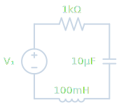
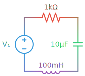

# @skillpet/circuit

[English](./README.md) | [简体中文](./README.zh-CN.md) | [日本語](./README.ja.md) | [한국어](./README.ko.md) | [Español](./README.es.md) | [Français](./README.fr.md) | [Deutsch](./README.de.md)

<p align="center">
  <strong>회로도 라이브러리 — JSON으로 전기 회로도를 렌더링. 인터랙티브 SVG, 테마, Vue / React 컴포넌트 지원.</strong>
</p>

<p align="center">
  <a href="https://www.npmjs.com/package/@skillpet/circuit"></a>
  <a href="https://www.npmjs.com/package/@skillpet/circuit"></a>
  <a href="https://circuit.skill.pet"></a>
</p>

---

**웹사이트 & 데모:** [circuit.skill.pet](https://circuit.skill.pet)

<p align="center">
  
  &nbsp;&nbsp;&nbsp;
  
  &nbsp;&nbsp;&nbsp;
  
</p>

## 기능

- 200개 이상의 내장 전기 부품 (저항, 커패시터, 다이오드, 트랜지스터, IC, 논리 게이트 등)
- Vue 3 & React 컴포넌트 즉시 사용 가능
- 인터랙티브 SVG: 호버 하이라이트, 툴팁, 클릭 이벤트
- 3가지 내장 테마 (라이트, 다크, 인쇄) + 커스텀 테마
- 부품 간 부드러운 색상 전환
- 간단한 JSON 설명으로 회로도 렌더링
- 브라우저 번들 (script 태그) & ESM / CJS 지원
- KaTeX 수학 수식 라벨 렌더링
- 순서도, DSP 블록, 브레드보드 부품
- 런타임 의존성 없음 (KaTeX은 선택사항)

## 설치

```bash
npm install @skillpet/circuit
```

## 빠른 시작

### React

```tsx
import { CircuitDiagram } from "@skillpet/circuit/react";

function App() {
  const circuit = {
    elements: [
      { type: "SourceV", d: "up", label: "12V" },
      { type: "ResistorIEEE", d: "right", label: "R1 10kΩ", id: "R1", tooltip: "100kΩ 탄소 피막 저항" },
      { type: "Capacitor", d: "down", label: "C1 100nF", id: "C1", tooltip: "세라믹 커패시터 100nF" },
      { type: "Line", d: "left" },
      { type: "Ground" },
    ],
  };

  return (
    <CircuitDiagram
      circuit={circuit}
      interactive
      theme="light"
      onElementClick={(info) => console.log("클릭:", info.id)}
      onElementHover={(info) => console.log("호버:", info.tooltip)}
    />
  );
}
```

### Vue 3

```vue
<script setup>
import { CircuitDiagram } from "@skillpet/circuit/vue";

const circuit = {
  elements: [
    { type: "SourceV", d: "up", label: "12V" },
    { type: "ResistorIEEE", d: "right", label: "R1 10kΩ", id: "R1", tooltip: "100kΩ 탄소 피막 저항" },
    { type: "Capacitor", d: "down", label: "C1 100nF", id: "C1", tooltip: "세라믹 커패시터 100nF" },
    { type: "Line", d: "left" },
    { type: "Ground" },
  ],
};

const onElementClick = (info) => console.log("클릭:", info.id);
</script>

<template>
  <CircuitDiagram
    :circuit="circuit"
    interactive
    theme="light"
    @element-click="onElementClick"
  />
</template>
```

### ESM / TypeScript

```ts
import { renderFromJson, mountFromJson } from "@skillpet/circuit";

// 정적 렌더링 — SVG 문자열 반환
const svg = renderFromJson({
  elements: [
    { type: "SourceV", d: "up", label: "12V" },
    { type: "ResistorIEEE", d: "right", label: "R1 10kΩ" },
    { type: "Capacitor", d: "down", label: "C1 100nF" },
    { type: "Line", d: "left" },
    { type: "Ground" },
  ],
});

// 인터랙티브 모드 — DOM에 마운트, 호버·툴팁·클릭 이벤트 지원
const ctrl = mountFromJson(document.getElementById("container")!, {
  elements: [
    { type: "ResistorIEEE", id: "R1", tooltip: "100kΩ 탄소 피막 저항" },
    { type: "Capacitor", d: "down", id: "C1", tooltip: "0.1μF 세라믹" },
  ],
}, { interactive: true });

ctrl.on("element:click", (info) => console.log("클릭:", info.id));
```

### 브라우저 (CDN)

```html
<div id="output"></div>
<script src="https://unpkg.com/@skillpet/circuit/dist/circuit.bundle.min.js"></script>
<script>
  document.getElementById("output").innerHTML = Circuit.renderFromJson({
    elements: [
      { type: "SourceV", d: "up", label: "12V" },
      { type: "ResistorIEEE", d: "right", label: "R1 10kΩ" },
      { type: "Capacitor", d: "down", label: "C1 100nF" },
      { type: "Line", d: "left" },
      { type: "Ground" },
    ],
  });
</script>
```

## 라이브 예제

이 저장소에는 브라우저에서 바로 실행할 수 있는 HTML 예제가 포함되어 있습니다:

| 파일 | 설명 |
|------|------|
| [`index.html`](index.html) | 전체 데모: 기본 회로, 테마, 인터랙티브, 색상 전환 |
| [`examples/01-basic.html`](examples/01-basic.html) | 최소 RC 회로 |
| [`examples/02-themes.html`](examples/02-themes.html) | 라이트 / 다크 / 인쇄 테마 비교 |
| [`examples/03-interactive.html`](examples/03-interactive.html) | 인터랙티브 모드 및 이벤트 로그 |
| [`examples/04-color-transitions.html`](examples/04-color-transitions.html) | 부품 간 부드러운 색상 그라데이션 |

모든 예제는 [unpkg](https://unpkg.com/@skillpet/circuit/) CDN에서 라이브러리를 로드합니다 — 빌드 불필요.

## 테마

3가지 내장 테마: `light` (기본값), `dark`, `print`.

<p align="center">
  
  &nbsp;&nbsp;&nbsp;&nbsp;
  
</p>

```ts
const svg = renderFromJson(circuit, { theme: "dark" });
```

## 색상 전환

다른 색상의 부품 간 부드러운 그라데이션 전환:

<p align="center">
  
</p>

```ts
const svg = renderFromJson({
  drawing: { colorTransition: true },
  elements: [
    { type: "SourceV", d: "up", color: "#2ecc71" },
    { type: "ResistorIEEE", d: "right", color: "#e74c3c" },
    { type: "Capacitor", d: "down", color: "#3498db" },
    { type: "Line", d: "left" },
    { type: "Ground" },
  ],
}, { colorTransition: true });
```

## 라이선스

이 저장소의 예제 코드는 MIT 라이선스입니다.

`@skillpet/circuit` 라이브러리 자체는 개인 및 교육 목적으로 무료 사용이 가능합니다. 상업적 사용에는 별도의 라이선스가 필요합니다.
자세한 내용은 [circuit.skill.pet/license](https://circuit.skill.pet/license)를 참조하시거나 **license@skill.pet**으로 문의해 주세요.
